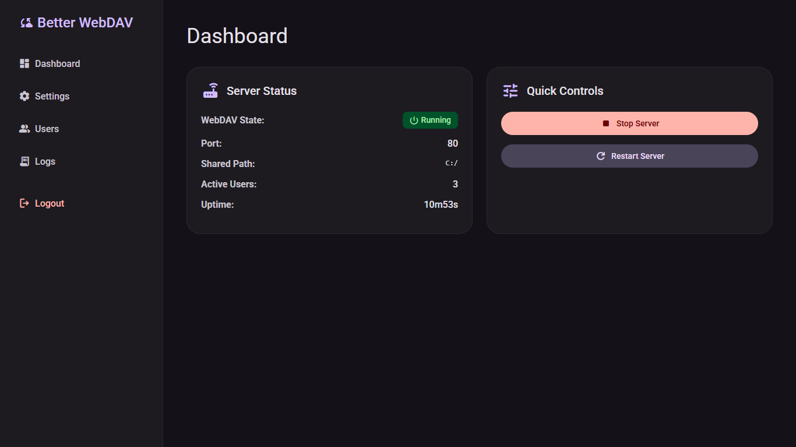
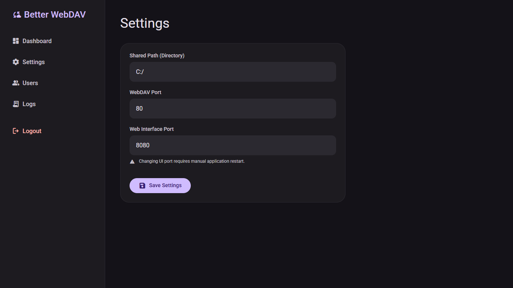
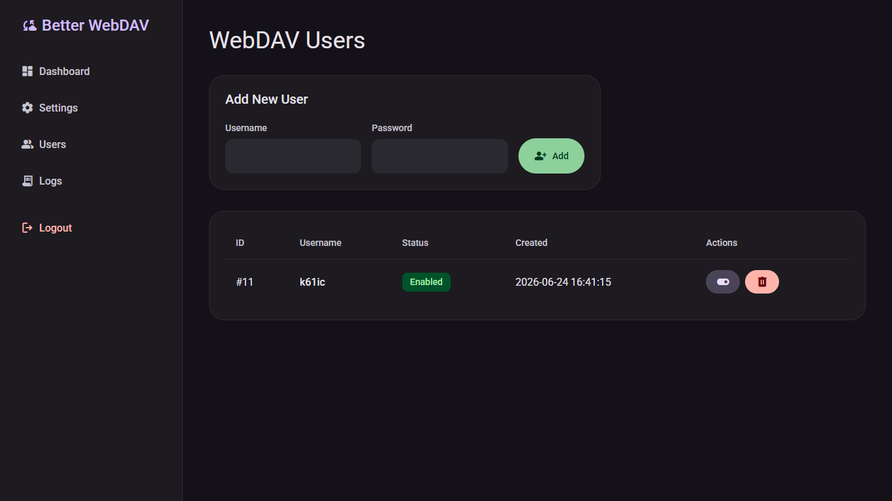
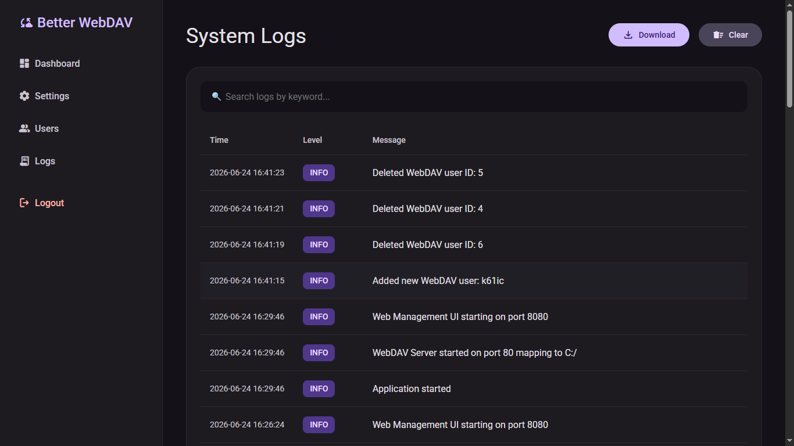
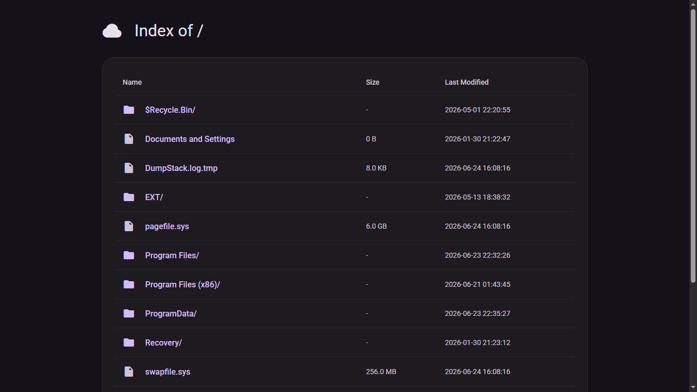

# Better WebDAV Server

Better WebDAV Server — это WebDAV-сервер с веб-панелью управления на Go.  
Проект объединяет загрузку и раздачу файлов по WebDAV, управление настройками, пользователями и системными логами в одном интерфейсе.

## Возможности

- **Dashboard** — сводка по состоянию сервера, порту и общей папке.
- **Settings** — изменение пути к общей директории и портов.
- **Users** — управление WebDAV-пользователями.
- **Logs** — просмотр, поиск, скачивание и очистка логов.
- **Explorer** — удобный просмотр содержимого WebDAV-каталога.
- **Безопасность** — сессии, CSRF-защита и защита от перебора пароля.
- **Автосоздание базы** — SQLite и необходимые таблицы создаются автоматически при запуске.

## Скриншоты

### Dashboard


### Settings


### Users


### Logs


### Explorer


### Запустите проект

- WebDAV-сервер поднимется автоматически;
- Веб-интерфейс откроется в браузере, если созданный администратор ещё не существует.

## Структура проекта

```text
.
├── main.go
├── internal/
│   ├── auth/
│   ├── config/
│   ├── database/
│   ├── handlers/
│   ├── logs/
│   └── webdav/
└── web/
    ├── static/
    └── templates/
```

## Хранение данных

Приложение использует локальные файлы:

- `data/storage.db` — база данных SQLite;
- `data/session.key` — секретный ключ для сессий;
- `logs/` — системные журналы.

Эти каталоги создаются автоматически при первом запуске.

## Основные страницы

- `/` — Dashboard
- `/settings` — Settings
- `/users` — Users
- `/logs` — Logs
- WebDAV endpoint — зависит от настроенного порта

## Технологии

- Go
- SQLite
- HTML templates
- CSS/JavaScript для интерфейса
